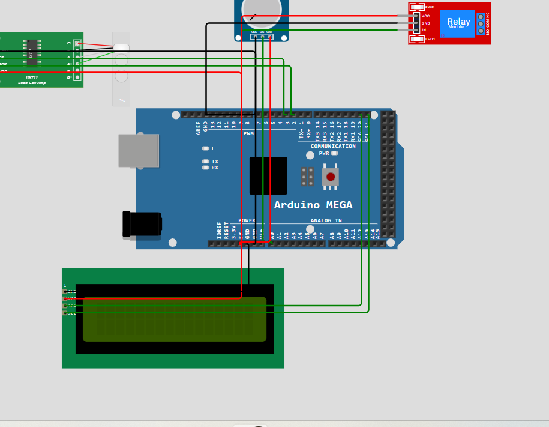
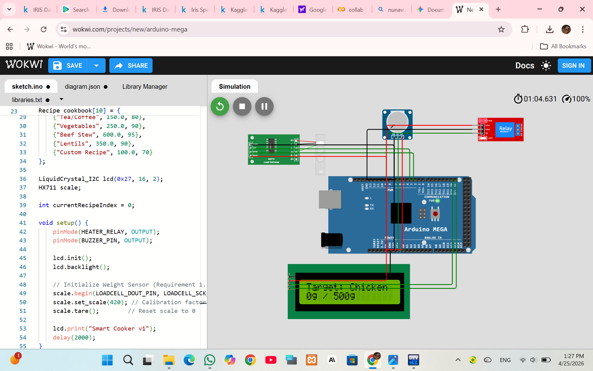
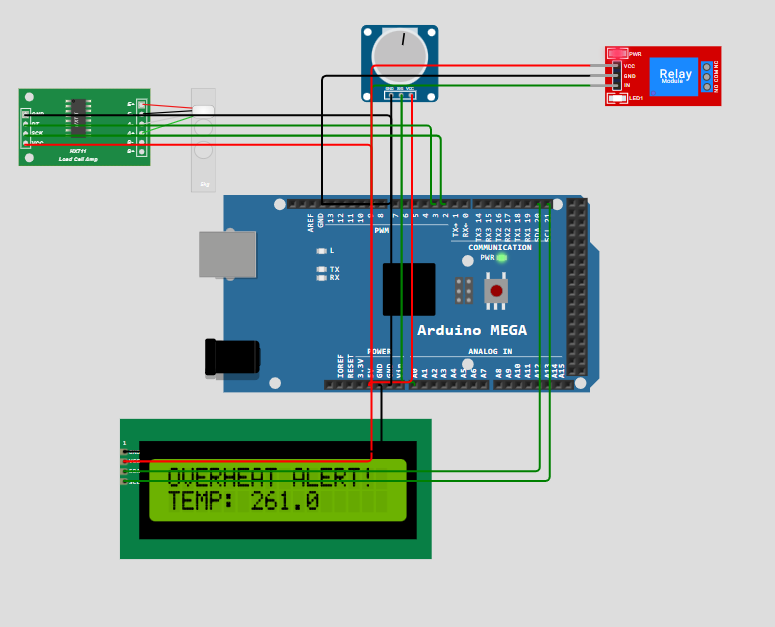

# SmartCook — Automated Cooking & Safety System

An Arduino-based smart cooking prototype designed to assist users with recipe guidance, real-time ingredient measurement, and cooking safety monitoring.

  
  
  
  

  

## Project Overview

An Arduino-based smart cooking prototype designed to assist users with recipe guidance, real-time ingredient measurement, and cooking safety monitoring.

## Project Overview

SmartCook is an embedded-system prototype that combines recipe management, ingredient weight monitoring, cooking guidance, user notifications, and thermal safety protection.

The system was developed as a BSIT semester project and tested using the Wokwi virtual prototyping platform.

## Key Features

- Recipe management
- Step-by-step cooking guidance
- Real-time ingredient weight monitoring
- HX711 load-cell integration
- LCD-based user feedback
- Buzzer notifications
- Temperature monitoring
- Automatic overheat protection
- Relay-based heater shutdown
- Wokwi hardware simulation

## How It Works

1. The user selects a recipe.
2. The system loads the required ingredient quantity.
3. The HX711 load-cell system monitors the ingredient weight.
4. The current weight is compared with the target quantity.
5. The system provides feedback to the user.
6. Temperature conditions are continuously monitored.
7. If an unsafe temperature is detected, the safety system interrupts the heating process and activates an alert.

## Hardware

- Arduino Mega 2560
- HX711 Load Cell Amplifier
- Load Cell Weight Sensor
- 16×2 I2C LCD
- Relay Module
- Piezo Buzzer
- Temperature Input

## Technologies Used

- C++
- Arduino
- Embedded Systems
- I2C Communication
- Wokwi
- Arduino IDE

## Testing

The system was tested through a Wokwi virtual hardware simulation.

| Test Case | Purpose | Status |
|---|---|---|
| TC-01 | Code compilation | Passed |
| TC-02 | Microcontroller boot-up | Passed |
| TC-03 | Hardware/interface stability | Passed |
| TC-04 | Recipe and weight tracking | Passed |
| TC-05 | Overheat safety mechanism | Passed |

## Screenshots

### Complete Circuit

### Weight Monitoring

### Overheat Alert

## Current Limitations

This project is currently a simulation-based prototype. The system uses a character LCD rather than an advanced graphical interface, and physical environmental factors would require further testing on real hardware.

## Future Improvements

- TFT touchscreen interface
- Mobile application
- Persistent recipe and progress storage
- Automated ingredient dispensing
- ESP32 Wi-Fi connectivity
- IoT-based recipe management

### Simulation & Testing

The system was tested using the Wokwi Arduino simulation environment to verify circuit behavior and system logic.

## Author

**Khadija Shoukat**

BSIT Student
