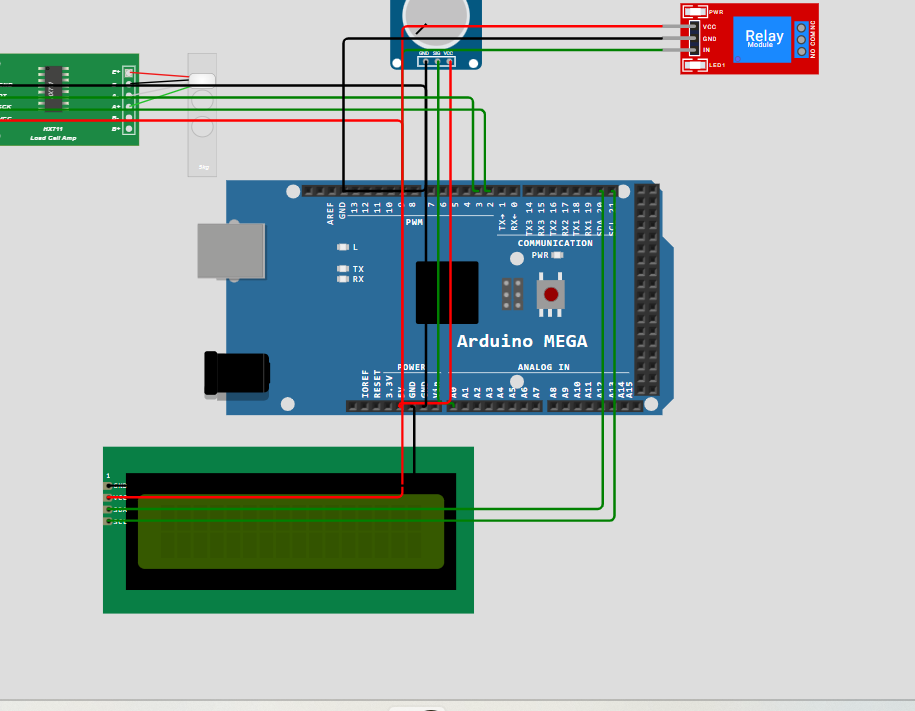
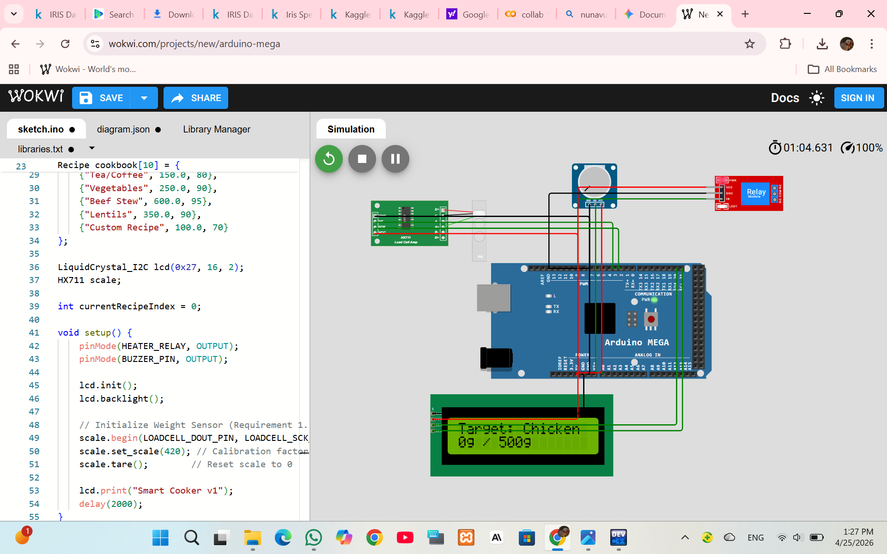
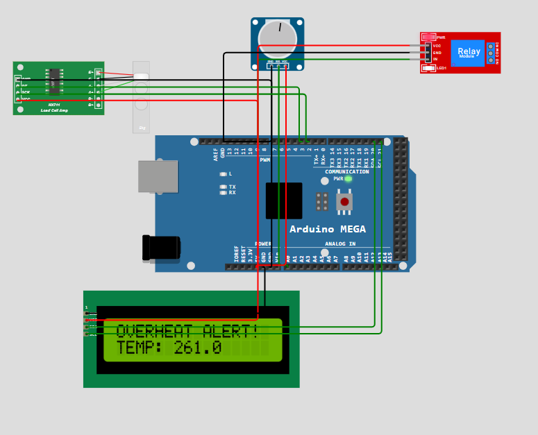

#  SmartCook — Automated Cooking & Safety System

> An intelligent Arduino-powered cooking assistant that combines precision ingredient measurement, real-time safety monitoring, and automated cooking guidance. Designed to demonstrate advanced embedded systems integration and IoT prototyping.

<p align="center">
  
  
  
  
</p>

<p align="center">
  <strong><a href="#-key-features">Features</a> • <a href="#-how-it-works">How It Works</a> • <a href="#-hardware-stack">Hardware</a> • <a href="#-testing--validation">Testing</a> • <a href="#-future-roadmap">Roadmap</a></strong>
</p>

---

##  Project Overview

**SmartCook** is a cutting-edge embedded systems prototype that automates the cooking process while prioritizing user safety. By integrating precision weight sensors, thermal monitoring, and intelligent recipe management, the system delivers a seamless cooking experience with built-in safeguards against common kitchen hazards.

###  Problem Statement
Traditional cooking methods lack real-time feedback on ingredient quantities and temperature monitoring, leading to wasted ingredients and potential safety risks. SmartCook solves this by providing:
- Automated ingredient measurement verification
- Continuous temperature monitoring and overheat prevention
- Step-by-step guided cooking assistance
- Multi-sensory user feedback system

---

##  Key Features

| Feature | Description |
|---------|-------------|
|  **Recipe Management** | Pre-loaded recipe database with precise ingredient specifications |
|  **Weight Monitoring** | Real-time HX711 load cell integration for accurate gram-level measurements |
|  **Smart Feedback System** | LCD display + buzzer alerts for ingredient verification and temperature warnings |
|  **Thermal Protection** | Continuous temperature monitoring with automatic relay-based heater shutdown |
|  **Safety-First Design** | Overheat detection and emergency alert system |
|  **User Interface** | I2C LCD interface for intuitive step-by-step guidance |

---

##  How It Works

The system operates in a continuous loop of measurement, verification, and safety monitoring:

```
User Selects Recipe
        ↓
System Loads Ingredient Targets
        ↓
HX711 Measures Weight in Real-Time
        ↓
Compare Measured vs. Target Weight
        ↓
User Receives Feedback (LCD + Buzzer)
        ↓
Temperature Continuously Monitored
        ↓
Unsafe Temp? → Heater Shutdown + Emergency Alert
        ↓
Cooking Process Continues...
```

### Step-by-Step Process
1. **Recipe Selection** — User picks a recipe from the system's menu
2. **Target Setting** — System displays required ingredient quantity
3. **Weight Calibration** — HX711 load cell is zeroed and ready
4. **Real-Time Monitoring** — Current weight is continuously measured
5. **Verification** — System alerts when target weight is reached
6. **Safety Check** — Temperature sensor monitors heat levels
7. **Emergency Response** — If temp exceeds threshold, relay cuts power to heater

---

##  Hardware Stack

### Microcontroller & Sensors
- **Arduino Mega 2560** — 54 I/O pins, high memory for recipe storage
- **HX711 Load Cell Amplifier** — 24-bit precision ADC for weight measurement
- **Load Cell Weight Sensor** — Precision digital weighing
- **Temperature Sensor** — Real-time thermal monitoring
- **16x2 I2C LCD** — User feedback and recipe guidance display
- **Relay Module** — Automated heater control
- **Piezo Buzzer** — Audio alert system

### Circuit Diagram


---

##  Technologies & Languages

```
Embedded Systems → Arduino Mega 2560
Programming Language → C++ (Arduino Sketch)
Communication Protocols → I2C, Serial
Hardware Simulation → Wokwi Virtual Prototyping
Development Environment → Arduino IDE
```

---

##  System Architecture

The system is organized into modular components:

- **Recipe Module** — Stores and manages recipe data
- **Weight Monitoring Module** — HX711 integration and calibration
- **Temperature Control Module** — Sensor reading and threshold management
- **User Interface Module** — LCD display and buzzer control
- **Safety Module** — Relay control and emergency shutdown logic

---

##  Testing & Validation

All components were rigorously tested using Wokwi's virtual hardware simulation environment:

| Test Case | Component | Objective | Result |
|-----------|-----------|-----------|--------|
| **TC-01** | Compilation | Verify code syntax and compilation | ✅ **Passed** |
| **TC-02** | Microcontroller | Confirm Arduino boot sequence | ✅ **Passed** |
| **TC-03** | Hardware Integration | Verify all interfaces work together | ✅ **Passed** |
| **TC-04** | Weight Tracking | Validate ingredient measurement accuracy | ✅ **Passed** |
| **TC-05** | Safety Mechanism | Test overheat protection and relay shutdown | ✅ **Passed** |

### Test Environment
- **Platform**: Wokwi Simulation
- **Coverage**: Hardware interface stability, sensor accuracy, safety logic
- **Status**: All critical features validated

---

## 📸 System in Action

### Complete Circuit Diagram


### Weight Monitoring Display


### Overheat Alert Mechanism


---

## 🚀 Current Implementation Status

| Component | Status | Notes |
|-----------|--------|-------|
| Recipe Database | ✅ Complete | Pre-loaded with test recipes |
| Weight Measurement | ✅ Complete | HX711 integration functional |
| Temperature Monitoring | ✅ Complete | Real-time sensor reading active |
| Safety Shutdown | ✅ Complete | Relay control tested and validated |
| LCD Interface | ✅ Complete | I2C communication stable |
| Wokwi Simulation | ✅ Complete | Full hardware emulation working |

---

##  Current Limitations

- **Platform**: Simulation-based prototype (Wokwi) — not yet deployed on physical hardware
- **UI**: Character LCD display (16x2) — basic compared to modern touchscreen interfaces
- **Testing**: Virtual environment only — real-world kitchen conditions not yet evaluated
- **Storage**: Limited recipe database in current memory — would require external storage for production
- **Connectivity**: No network features in current version

---

##  Future Roadmap

### Phase 2: Enhanced UI & Connectivity
- [ ] TFT touchscreen interface with color recipe visualization
- [ ] ESP32 upgrade for Wi-Fi connectivity
- [ ] IoT recipe cloud sync

### Phase 3: Advanced Features
- [ ] Mobile app integration (iOS/Android)
- [ ] Voice-guided cooking instructions
- [ ] Persistent storage (SD card / EEPROM)
- [ ] Automated ingredient dispensing system
- [ ] Multi-user profiles and preferences

### Phase 4: Production & Scaling
- [ ] Real-world kitchen testing and validation
- [ ] Advanced safety certifications
- [ ] Commercial prototype development
- [ ] Power management optimization

---

##  Project Context

**Developed as**: BSIT Semester Project  
**Academic Focus**: Embedded Systems Design, Hardware Integration, IoT Prototyping  
**Learning Outcomes**: 
- Mastery of Arduino microcontroller programming
- I2C communication protocol implementation
- Real-time sensor integration and data processing
- Safety-critical system design
- Wokwi simulation environment expertise

---

##  How to Use This Repository

1. **Explore the Code** — Check `/src` for Arduino sketches and hardware integration
2. **View Simulation** — Open `.wokwi` files in Wokwi editor for live testing
3. **Study the Documentation** — Hardware setup and connections detailed in circuit diagrams
4. **Run on Hardware** — Deploy on Arduino Mega 2560 with recommended component setup

---

##  Key Learnings

This project demonstrates:
-  ●Real-time embedded systems programming
-  ●Multi-sensor integration and data fusion
-  ●Safety-critical system design patterns
-  ●Hardware-software co-design
-  ●I2C protocol mastery
-  ●Virtual prototyping best practices

---

##  Author

**Khadija Shoukat**  
*BSIT Student | Embedded Systems Enthusiast | IoT & Automation Specialist*

 Connect with me on [LinkedIn](https://linkedin.com/in/khadija-shoukat) | 🔗 View my [GitHub](https://github.com/khadija394)

---

##  License

This project is provided for educational and academic purposes. For commercial or professional use, please contact the author.

---

<p align="center">
  <strong> If this project helped you, please consider giving it a star! </strong>
</p>

<p align="center">
  <em>Built with  using Arduino and embedded systems passion</em>
</p>
